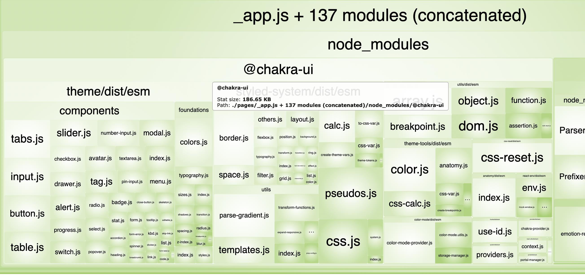
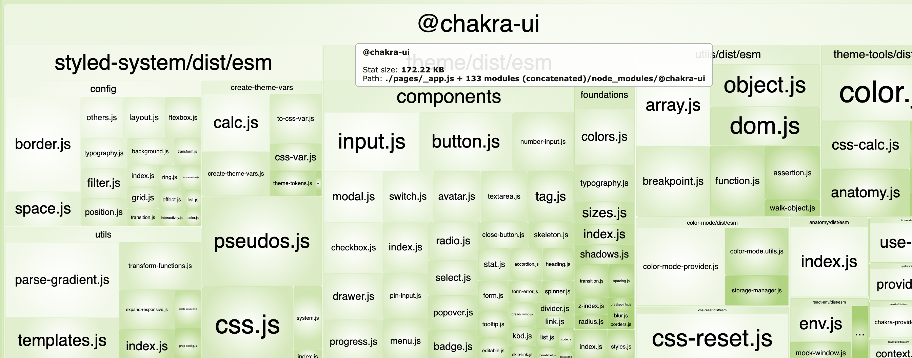

## chakra-ui-optimization-loader

Reduce bundle size of chakra-ui via webpack loader.

**This loader doesn't ensure to safe your runtime code, be careful to add it.**

## Supporting keys

- components
- colors
- breakpoints

## Usage

```sh
$ npm i chakra-ui-optimization-loader
```

```js
module.exports = {
  module: {
    rules: [
      test: /\.js/,
      include: resolve('./node_modules/@chakra'),
      loader: 'chakra-ui-optimization-loader',
      options: {
        ignoreComponents: ['Alert', 'Table', 'Tabs', 'Slider'],
        ignoreColors: [
          'facebook',
          'purple',
          'green',
          'pink',
          'linkedin',
          'facebook',
          'messenger',
          'whatsapp',
          'twitter',
          'telegram',
        ],
        ignoreBreakpoints: ['xl', '2xl'],
      },
    ]
  }
};
```

## Comparing

See [the test code](./tests/nextjs).

### w/o the loader

@chakra-ui: 186kb



### w/ the loader

Using the config of its usage.

@chakra-ui: 172.kb


